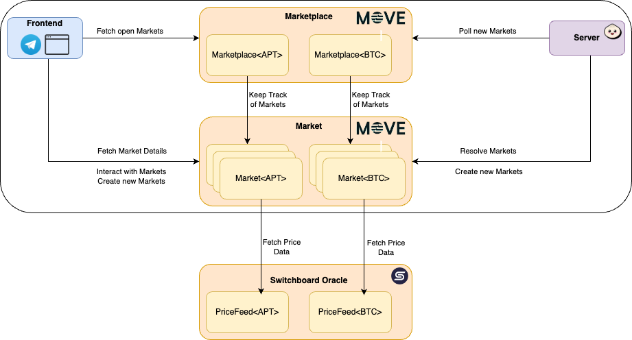

<div align="center" style="background-color: #ffcd0a;">
  
</div>

## Panana Predictions

Panana Predictions is a **decentralized prediction market** platform built on the Aptos blockchain. Designed as a **Telegram app** for ease of use and to attract new users, it allows participants to predict future asset prices and real-world events in a user-friendly environment.

## Table of Contents

- [Introduction](#introduction)
- [Key Features](#key-features)
- [Project Information](#project-information)
- [Tech Stack](#tech-stack)
- [Architecture Overview](#architecture-overview)
- [Installation and Setup](#installation-and-setup)
- [Vision and Roadmap](#vision-and-roadmap)
- [Team](#team)
## Introduction

Panana Predictions is a decentralized platform that enables users to **create their own markets** and **predict the future prices** of various assets, as well as the **outcomes of future real-world events**, such as sports or politics. By offering a simple and engaging way for users to participate in prediction markets directly through **Telegram**, we aim to make decentralized finance **accessible to everyone**.

## Key Features

- **Telegram Bot Integration**: Interact with Panana Predictions directly within Telegram for ease of use.
- **Decentralized Prediction Markets**: Users can create their own markets and predict future asset prices.
- **Statistics and Historical Data**: A personalized performance dashboard allows users to track their past predictions and analyze historical data.
- **Automation**: A backend server responsible to ensure scheduled market creation and auto-resolving markets.
- **Trustless Pricefeed**: Used for fetching reliable asset price data on-chain via Switchboard oracles.

## Project Information

Panana Predictions was built from the ground up exclusively for the **Aptos Code Collision Hackathon**. Within the hackathon period, we developed the entire platform, including smart contracts, web application, and Telegram integration. Our goal is to continue developing Panana Predictions beyond the hackathon, expanding its features and user base.

- **Commits**: Over 100 commits
- **Lines of Code**: Over 10,000 lines of code

## Tech Stack

Panana Predictions leverages a modern and robust tech stack to provide a seamless user experience:

- **Aptos Move**: Provides the decentralized platform for our smart contracts.
- **Next.js**: A state-of-the-art React framework for building the web application.
- **React**: For building interactive user interfaces.
- **TypeScript**: Ensuring type safety and code reliability.
- **Bun**: Powers the backend server.
- **Switchboard Oracles**: Used for fetching reliable asset price data.
- **Telegram Bot API**: Integrates the platform into Telegram for easy user access.

Our marketplace and market move modules are designed for decentralized security, ensuring that all transactions are transparent and secure.

## Architecture Overview

Panana Predictions consists of three fundamental parts:

### 1. Marketplace and Market Move Modules

At the heart of Panana Predictions are the **Marketplace** and **Market Move Modules**.

- The **Marketplace Module** manages all markets for a specific asset (i.e. APT or BTC)
- The **Market Module** handles the interactions for placing bets, transferring assets, and distributing winnings based on market outcomes.
- All modules are designed in a way that allows an **easy extension** to add new Markets and asset types.
- **Switchboard Oracles** ensure a trusted and decentralized resolution of markets.

### 2. Telegram App & Web Application (Next.js)

To interact with the prediction markets, users access the platform via Telegram or the web. Built as a cutting-edge **Next.js** web application **optimzed for Telegram and the web**, the front-end provides a seamless and intuitive interface. All interactions and data fetching occur directly with the Aptos blockchain.


### 3. Server for Auto-Resolving Markets

The third component is a server that is responsible for **automatically resolving prediction markets** when they close. The server polls for new markets and is responsible for their resolution. This includes:

- **Resolution Scheduling**: The server schedules a new job to resolve the market at a specific time.
- **Market Resolution**: The server calls the Market module, which retrieves the final price data on-chain via a Switchboard Oracle and distributes the rewards.
- **Ensure Eventual Resolution:** By implementing a retry-mechanism in case the initial resolution failed, an eventual resolution is guaranteed.

### Architecture Diagram
The following diagram shows the interaction between all above mentioned components.
<div align="center">
  
</div>

## Installation and Setup

To set up the project locally, follow these steps:

1. Clone the repository:
   ```bash
   git clone https://github.com/servrox-solutions/panana-predictions.git
   ```

2. Navigate into the directory:
   ```bash
   cd panana-predictions
   ```

3. Install dependencies for the Next.js web application:
   ```bash
   pnpm install
   ```

4. Publish the move package and make the types available (requires a pre-funded wallet)
   ```bash
   pnpm run move:publish && pnpm run move:types
   ```

5. Run the Next.js web application:
   ```bash
   pnpm run dev
   ```

6. Launch the server (requires bun):
   ```bash
   cd ./server && pnpm install && cd - && pnpm run server
   ```

## Vision and Roadmap

**Panana Predictions** aims to be the leading decentralized prediction market platform on the Aptos network, offering users the ability to bet not only on crypto asset prices but also on real-world events, such as sports, politics, and more. All through an easy-to-use Telegram app. As we continue to grow, we are committed to introducing new features that enhance user experience and expand the platform's capabilities.


### **Milestone 1 - Mainnet Launch (Q4 2024):**
- **Objective:** Officially launch Panana Predictions on the Aptos mainnet.
- **Features:** 
  - Full functionality for predicting real-world events and crypto asset prices, accessible via both WebApp and Telegram Bot.
  - Generate traction through X and other channels.
  - Smart contract audits to ensure security and transparency.
  - Implement metrics to evaluate future success of the plattform.

### **Milestone 2 - Creation of Panana Liquidity Token and Implementation of Optimistic Resolution (Q1 2025):**
- **Objective:** Introduce a Panana Liquidity Token (PLT) to enhance market liquidity and unlock user stakes.
- **Features:** 
  - Users will receive liquidity tokens in exchange for their staked assets, enabling liquidity without locking up funds.
  - These liquidity tokens can be traded or used in DeFi protocols, adding more flexibility for users.
  - Liquidity incentives and staking rewards to increase engagement and participation.
  - Implement an optimistic resolution strategy to resolve markets in a decentralized manner.

### **Milestone 3 - Multi-Token Betting (Q2 2025):**
- **Objective:** Expand token support beyond the current assets.
- **Features:**
  - Allow users to place bets using stablecoins and meme-coins popular in the Aptos ecosystem.
  - Enhanced flexibility in asset choices, broadening the appeal for a wider user base.

### **Milestone 4 - Further Marketplace Scaling and Growth (Q3 2025 onward):**
- **Objective:** Launch targeted marketing campaigns and features to grow the Panana user base and scale the marketplace.
- **Features:**
  - Social media campaigns, influencer partnerships, and paid advertisements to raise awareness.
  - Community-driven growth through referral programs and incentive schemes.
  - Ongoing user education and outreach, focusing on global adoption and partnerships with other platforms.
  - Multilingual support for global accessibility.

## Team

Panana Predictions is built by a dedicated team with a diverse set of skills and extensive experience in software development, design, and blockchain technology.

- **Marcel**: With over 9 years of experience in software development and a strong track record in Customer Innovation and New Business at Porsche Digital, Marcel brings a wealth of expertise in software architecture, development, and blockchain technology.
- **Aaron**: With over 7 years of software engineering experience across various industries, Aaron specializes in infrastructure design for high scalability and availability. He has a proven track record of leading technological growth and winning multiple hackathons.
- **Marco**: The designer and UX artist behind Panana Predictions, Marco ensures that the user experience is intuitive and engaging.
- **Mr. Peeltos**: The mascot and spirit of Panana Predictions, Mr. Peeltos brings a fun and friendly face to our platform.

Our team's combined expertise makes us well-suited to build and sustain a prediction market platform on Aptos.

---

Thank you for using the Panana Predictions! If you have any questions, feel free to open an issue or contribute to improving the platform.

<div align="center" style="background-color: #ffcd0a;">
  
</div>
